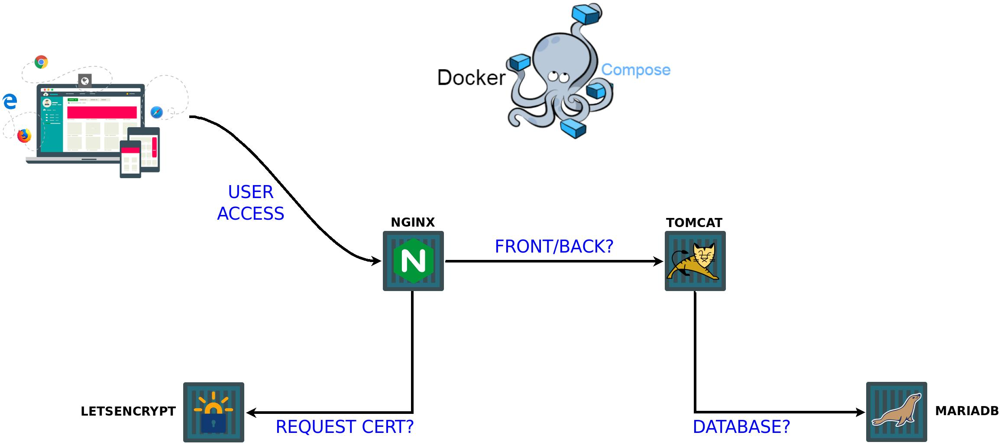

# Sistematx - Infrastructure

## Containers

- *Reverse Proxy* - Nginx;
- *Letsencrypt* - Nginx;
- *Frontend* - Tomcat;
- *Database* - MariaDB.

4 Containers.

## Infrastructure



## Requisites

- Git version 2 or above
- Docker version 17.09.1-ce or above (https://docs.docker.com/install/)
- Docker Compose 1.20.1 or above (https://docs.docker.com/compose/install)

## Installation

Clone the repository with:
```
user@host:~# git clone https://github.com/bgcorreia/sistematx.git
```

## Pre-Execution

Create file `.env` in root directory on repository informing enviremont variables, content example:

```bash
user@host:~/sistematx# cat .env
APPNAME=sistematx
DOMAIN=ufpb.br
EMAIL_LETS=email_valid@domain.com
DB_NAME=asterdb
DB_USER=asterdb
DB_PASS=123
TOMCAT_USER=tomcat
TOMCAT_PASS=456
```

OBS.: Is very important in variable `EMAIL_LETS` define a valid email!

Copy content frontend files Sistematx for directory `volumes/sistematx/`, thus:

```bash
user@host:~/sistematx# ls -l volumes/sistematx/
total 64
drwxr-xr-x 5 user user  4096 Mar  9 18:06 assets
-rwxr-xr-x 1 user user   395 Feb 23 16:12 _gitattributes
-rwxr-xr-x 1 user user   617 Feb 23 16:12 _gitignore
-rwxr-xr-x 1 user user  1609 Mar  9 18:06 howto.txt
-rwxr-xr-x 1 user user   446 Mar  9 18:06 index.html
-rwxr-xr-x 1 user user   367 Mar  9 18:06 index.jsp
drwxr-xr-x 2 user user  4096 Mar 17 19:18 license
-rwxr-xr-x 1 user user 13672 Mar  9 18:06 license.cxl
drwxr-xr-x 7 user user  4096 Apr 28 13:28 marvin_js
drwxr-xr-x 2 user user  4096 Mar  9 18:06 META-INF
drwxr-xr-x 2 user user  4096 Apr 28 05:34 resources
drwxr-xr-x 5 user user  4096 Apr 28 13:22 view
drwxr-xr-x 4 user user  4096 Mar  9 18:06 WEB-INF
```
After, copy file `webservices.war` in directory `volumes`, thus:

```bash
user@host:~/sistematx# ls -l volumes/
total 152416
drwxr-xr-x 2 user user      4096 Apr 28 15:12 db
drwxr-xr-x 2 user user      4096 Apr 28 15:12 esapi
drwxr-xr-x 2 user user      4096 Apr 28 15:12 licenses
drwxr-xr-x 9 user user      4096 Apr 28 15:15 sistematx
-rwxr-xr-x 1 user user 156053483 Apr 28 00:09 webservices.war
```

**Database files?**

Just add their sql files in the `build/db/dump/` directory, they will be executed in the container in alphabetical order. So if you have a `schema.sql` and `data.sql` file, is important renaming them to `1-schema.sql` and `2-data.sql`. 

If you want, you can compress them (to reduce space) in a format accepted by the docker (gzip, bzip2 our xz) and the container will do the extraction.

## Execution

In the root repository, execute the next command:

```bash
user@host:~/sistematx# docker-compose up --build -d
```
The option `-d` execute containers in background.

Is necessary wait approximately five minutes (depended hardware configuration hosted) to deploy the webservices.war on Tomcat. Is possible check process with:

```bash
user@host:~/sistematx# docker-compose logs -f
```

The option `-f` stay logs in screen, to cancel execute Ctrl + C.

After seeing the message below in logs, the deploy of webservices (and the other path) will be finalized and your application is running and ready to access under port 80.

```
[...]
sistematx_tomcat                | 30-Apr-2018 19:43:56.462 INFO [localhost-startStop-1] org.apache.catalina.startup.HostConfig.deployWAR Deployment of web application archive [/usr/local/tomcat/webapps/webservices.war] has finished in [289,237] ms
sistematx_tomcat                | 30-Apr-2018 19:43:56.466 INFO [localhost-startStop-1] org.apache.catalina.startup.HostConfig.deployDirectory Deploying web application directory [/usr/local/tomcat/webapps/ROOT]
sistematx_tomcat                | 30-Apr-2018 19:43:56.478 WARNING [localhost-startStop-1] org.apache.catalina.startup.SetContextPropertiesRule.begin [SetContextPropertiesRule]{Context} Setting property 'antiJARLocking' to 'true' did not find a matching property.
sistematx_tomcat                | 30-Apr-2018 19:44:07.576 WARNING [localhost-startStop-1] org.apache.catalina.startup.ContextConfig.validateSecurityRoles Security role name [admin] used in an <auth-constraint> without being defined in a <security-role>
sistematx_tomcat                | 30-Apr-2018 19:44:07.779 INFO [localhost-startStop-1] org.apache.catalina.startup.HostConfig.deployDirectory Deployment of web application directory [/usr/local/tomcat/webapps/ROOT] has finished in [11,313] ms
sistematx_tomcat                | 30-Apr-2018 19:44:07.781 INFO [localhost-startStop-1] org.apache.catalina.startup.HostConfig.deployDirectory Deploying web application directory [/usr/local/tomcat/webapps/examples]
sistematx_tomcat                | 30-Apr-2018 19:44:08.256 INFO [localhost-startStop-1] org.apache.catalina.startup.HostConfig.deployDirectory Deployment of web application directory [/usr/local/tomcat/webapps/examples] has finished in [475] ms
sistematx_tomcat                | 30-Apr-2018 19:44:08.261 INFO [localhost-startStop-1] org.apache.catalina.startup.HostConfig.deployDirectory Deploying web application directory [/usr/local/tomcat/webapps/host-manager]
sistematx_tomcat                | 30-Apr-2018 19:44:08.306 INFO [localhost-startStop-1] org.apache.catalina.startup.HostConfig.deployDirectory Deployment of web application directory [/usr/local/tomcat/webapps/host-manager] has finished in [45] ms
sistematx_tomcat                | 30-Apr-2018 19:44:08.307 INFO [localhost-startStop-1] org.apache.catalina.startup.HostConfig.deployDirectory Deploying web application directory [/usr/local/tomcat/webapps/docs]
sistematx_tomcat                | 30-Apr-2018 19:44:08.357 INFO [localhost-startStop-1] org.apache.catalina.startup.HostConfig.deployDirectory Deployment of web application directory [/usr/local/tomcat/webapps/docs] has finished in [49] ms
sistematx_tomcat                | 30-Apr-2018 19:44:08.359 INFO [localhost-startStop-1] org.apache.catalina.startup.HostConfig.deployDirectory Deploying web application directory [/usr/local/tomcat/webapps/manager]
sistematx_tomcat                | 30-Apr-2018 19:44:08.409 INFO [localhost-startStop-1] org.apache.catalina.startup.HostConfig.deployDirectory Deployment of web application directory [/usr/local/tomcat/webapps/manager] has finished in [50] ms
[...]
```

If you want to use ssl, continue to the section below, if not, stop here and enjoy!

## SSL

Per default, the first execution use no-ssl. Case need use ssl, after execution (with containers running), do following:

```
user@host:~/sistematx# docker exec letsencrypt  bash -c 'certbot certonly --email ${EMAIL_LETS} -a webroot --webroot-path=/usr/share/nginx/html -d ${FQDN} --agree-tos'
```

The successful return message from the certificate request will be:

```
Saving debug log to /var/log/letsencrypt/letsencrypt.log
Obtaining a new certificate
Performing the following challenges:
http-01 challenge for {APPNAME}.{DOMAIN}
Using the webroot path /usr/share/nginx/html for all unmatched domains.
Waiting for verification...
Cleaning up challenges
Generating key (2048 bits): /etc/letsencrypt/keys/0000_key-certbot.pem
Creating CSR: /etc/letsencrypt/csr/0000_csr-certbot.pem
IMPORTANT NOTES:
 - Congratulations! Your certificate and chain have been saved at
   /etc/letsencrypt/live/homesistematx.justicafacil.com/fullchain.pem.
   Your cert will expire on 2018-07-29. To obtain a new or tweaked
   version of this certificate in the future, simply run certbot
   again. To non-interactively renew *all* of your certificates, run
   "certbot renew"
 - If you lose your account credentials, you can recover through
   e-mails sent to ${EMAIL_LETS}.
 - Your account credentials have been saved in your Certbot
   configuration directory at /etc/letsencrypt. You should make a
   secure backup of this folder now. This configuration directory will
   also contain certificates and private keys obtained by Certbot so
   making regular backups of this folder is ideal.
 - If you like Certbot, please consider supporting our work by:

   Donating to ISRG / Let's Encrypt:   https://letsencrypt.org/donate
   Donating to EFF:                    https://eff.org/donate-le
   
```

After, in projecty directory:

```
user@host:~/sistematx# docker-compose restart proxy_sistematx
Restarting proxy ... done
```

Enjoy!
